# Altschool Month 1 Assessment
## Task 1 - Static Website Hosting Using S3 + IAM User with Limited Permissions
###  S3 Buckets
### 1. Cloudlaunch-site-bucket
- Create a folder cloud-watch-website in the root directory
- Add the following files index.html, styles.css and scripts.js
- Populate the files with basic contents
To create the S3 bucket for static site hosting
- Login to the aws management console
- Search for S3 on the search bar in the header and select it from the drop down that shows
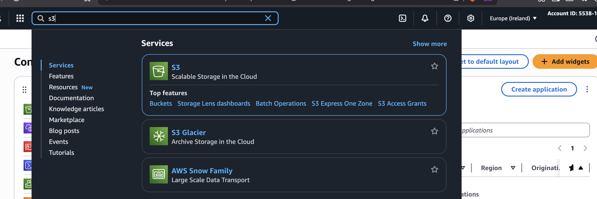
- Click on the create s3 bucket action button to open the s3 setup window
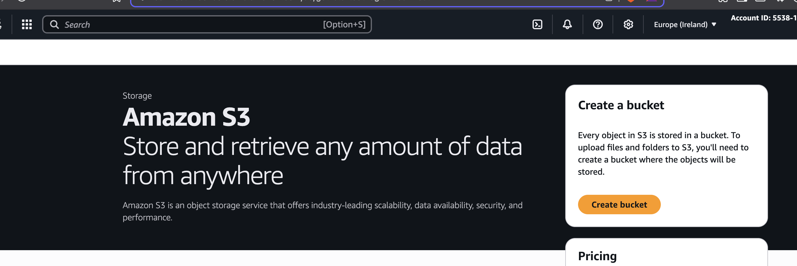
- In the bucket set up General Configuration section, set the bucket set the bucket name to "Cloudlaunch-site-bucket"
- In the Block Public Access settings for this bucket section, uncheck "Block all public access" which is checked by default, this will allow the bucket objects to be publicly accessible which is essential for static site hosting
- Keep the rest of the settings as default, the completed setup should look like this
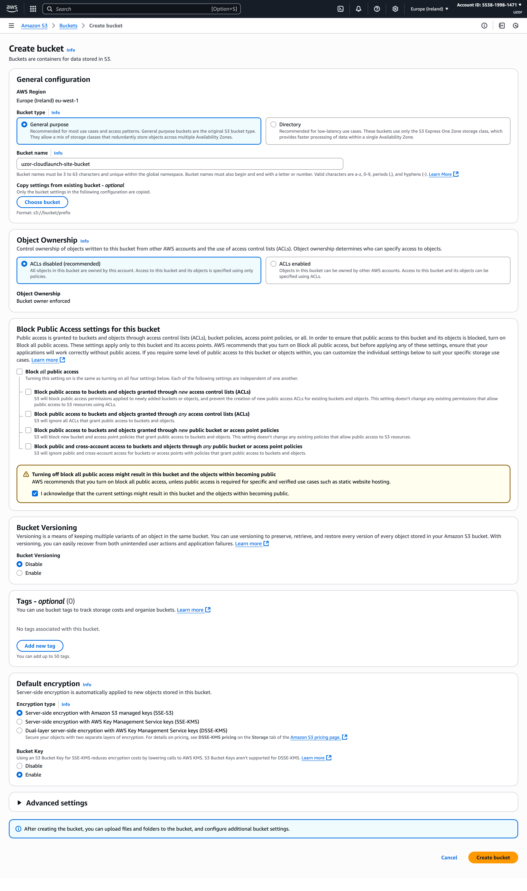
- Click on "Create Bucket" to create the bucket, if successful, you will be directed to the buckets list page
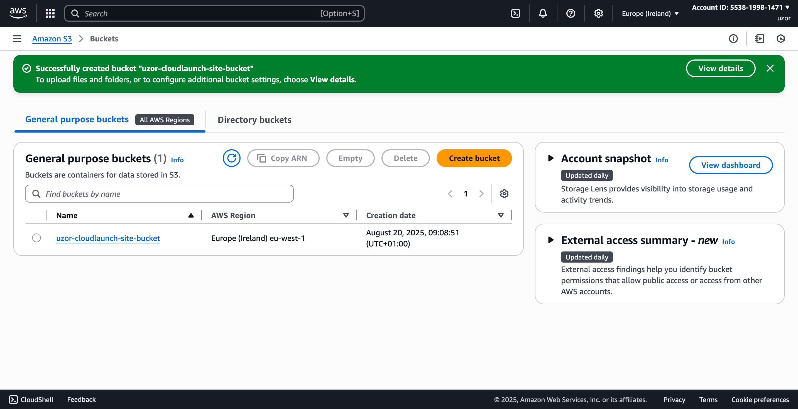
- Click on the name of the bucket, it will direct to the bucket details section for this bucket
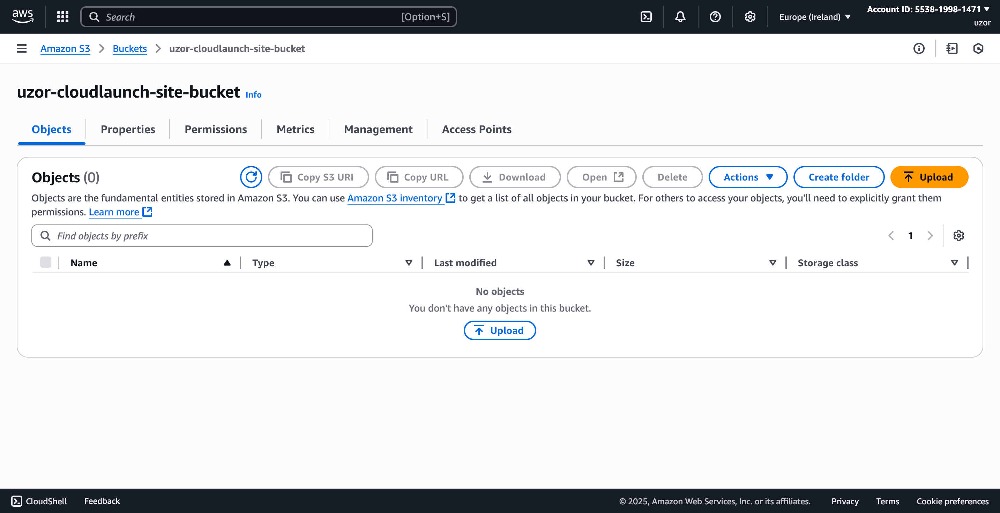
- Click on the "Upload" button and it will open the upload action page, select "add file" and proceed to upload the index.html, styles.css and scripts.js files from the cloud-watch-website folder in this directory
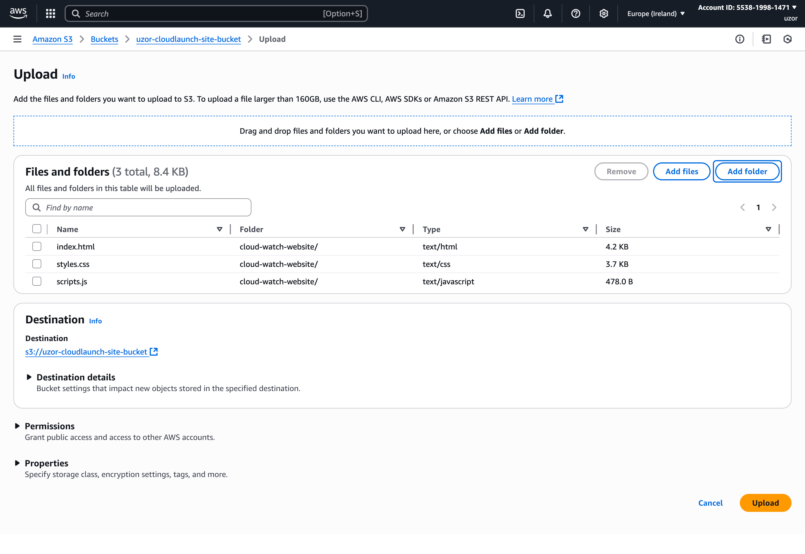
- Return to the bucket details page, and click on the properties tab. Scroll down to the static site hosting section and click on "edit"
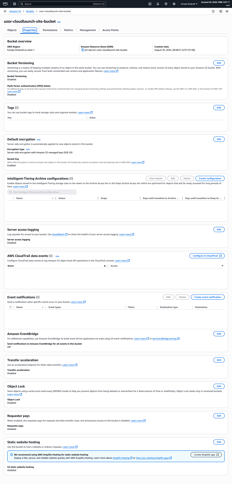
- In the static site setup form, enable static site hosting and provide the path to the index page in my case "cloud-watch-website/index.html" and then click on save changes
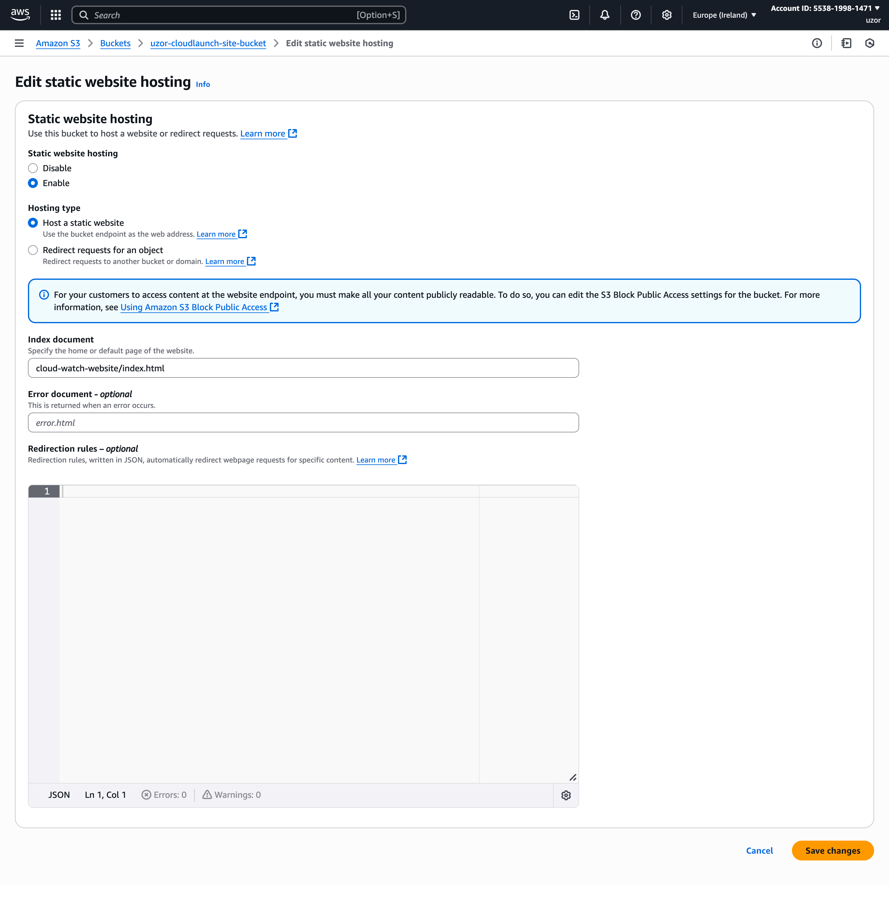
- Navigate to object ownership under the permissions tab and click on "edit"
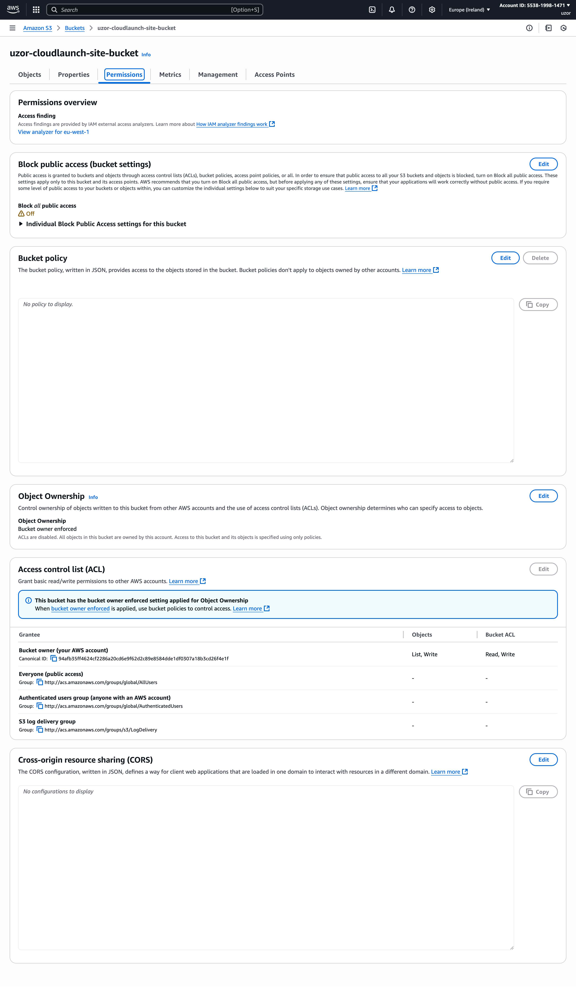
- On the setup page click select ACLs enabled, check the acknowledgement box and click on "save changes"
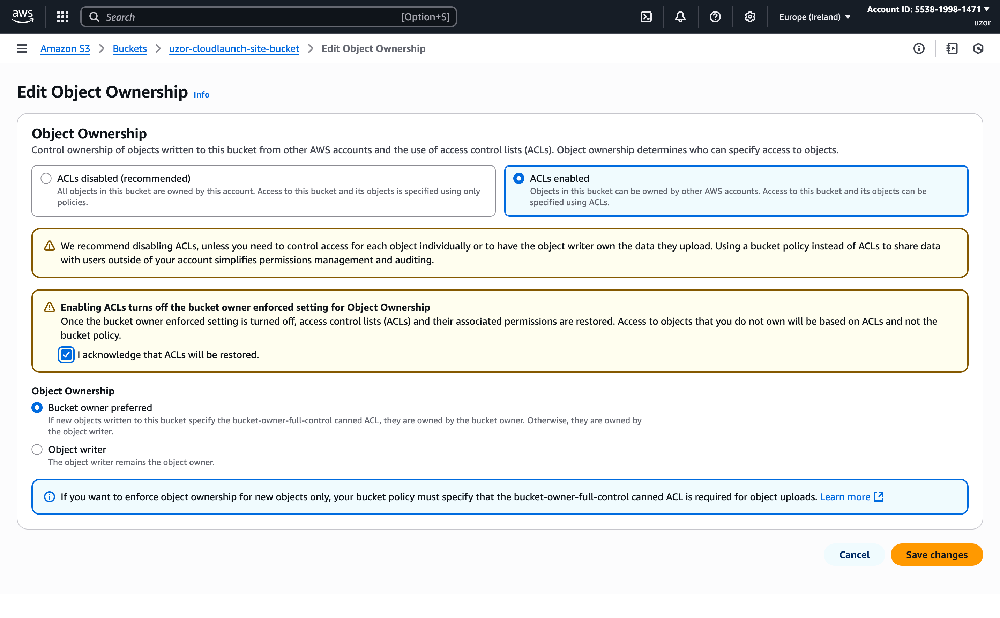
- Return to the objects tab and select all the objects in the bucket 
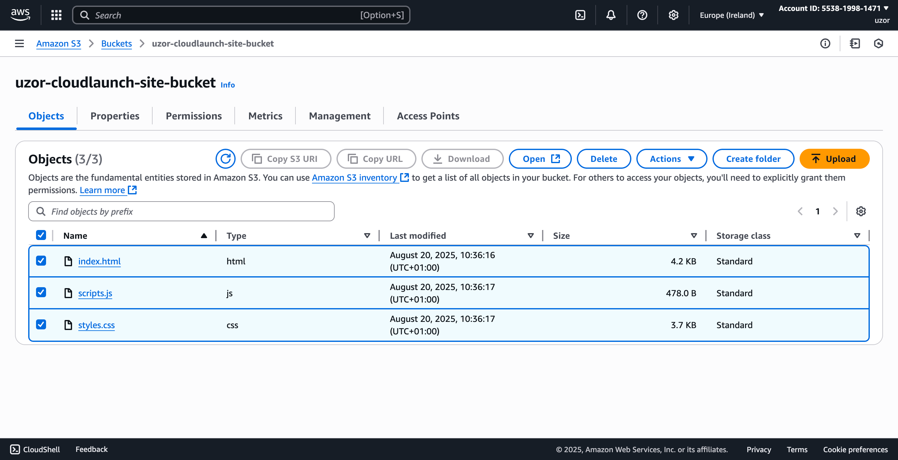
Click on the "Action" button at the top and in the dropdown that appears, click on "make public acls"
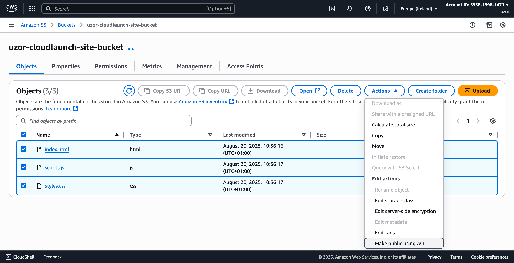
- Return to the bucket details page and select the properties tab, scroll down to the "Static website hosting" and click on the "Bucket website endpoint" link
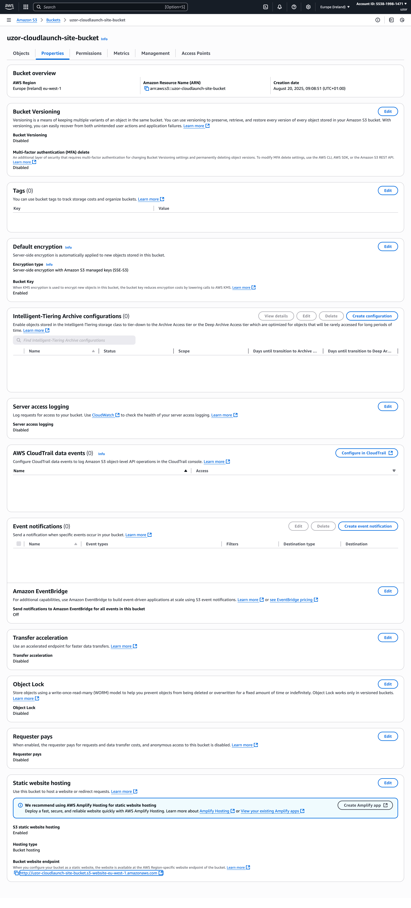

In my case the url is 
[http://uzor-cloudlaunch-site-bucket.s3-website-eu-west-1.amazonaws.com/](http://uzor-cloudlaunch-site-bucket.s3-website-eu-west-1.amazonaws.com/)