# Altschool Month 1 Assessment
## Task 1 - Static Website Hosting Using S3 + IAM User with Limited Permissions
###  S3 Buckets
### 1. Cloudlaunch-site-bucket
- Create a folder cloud-watch-website in the root directory
- Add the following files index.html, styles.css and scripts.js
- Populate the files with basic contents
To create the S3 bucket for static site hosting
- Login to the aws management console
- Search for S3 on the search bar in the header and select it from the drop down that shows

- Click on the create s3 bucket action button to open the s3 setup window
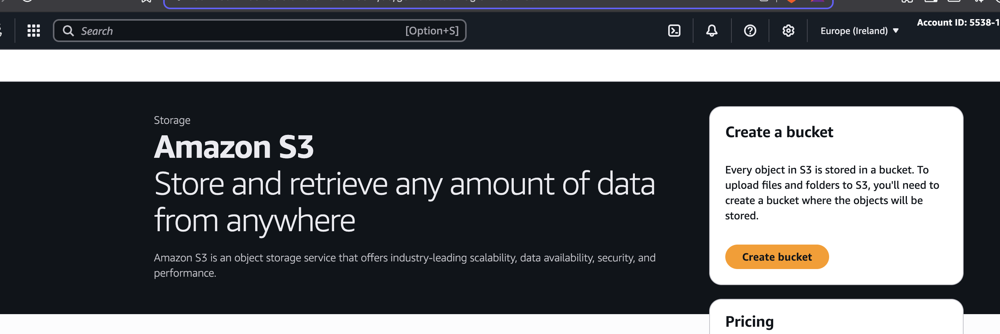
- In the bucket set up General Configuration section, set the bucket set the bucket name to "Cloudlaunch-site-bucket"
- In the Block Public Access settings for this bucket section, uncheck "Block all public access" which is checked by default, this will allow the bucket objects to be publicly accessible which is essential for static site hosting
- Keep the rest of the settings as default, the completed setup should look like this
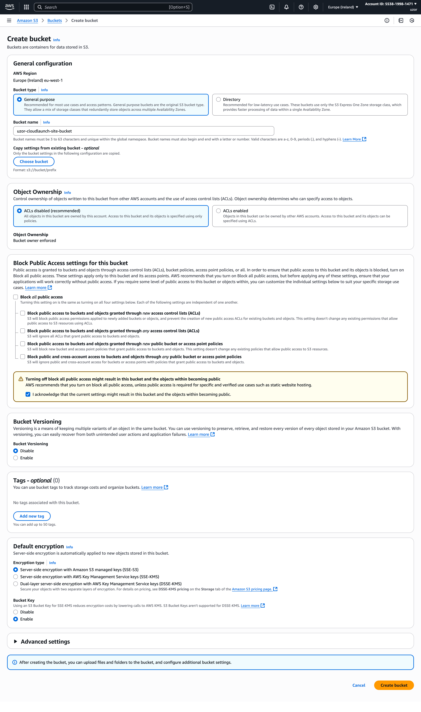
- Click on "Create Bucket" to create the bucket, if successful, you will be directed to the buckets list page
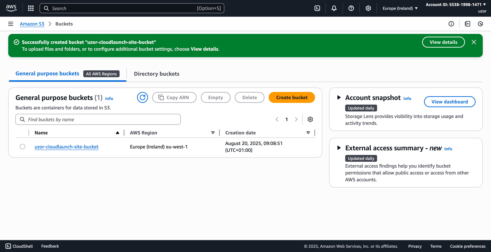
- Click on the name of the bucket, it will direct to the bucket details section for this bucket

- Click on the "Upload" button and it will open the upload action page, select "add file" and proceed to upload the index.html, styles.css and scripts.js files from the cloud-watch-website folder in this directory

- Return to the bucket details page, and click on the properties tab. Scroll down to the static site hosting section and click on "edit"
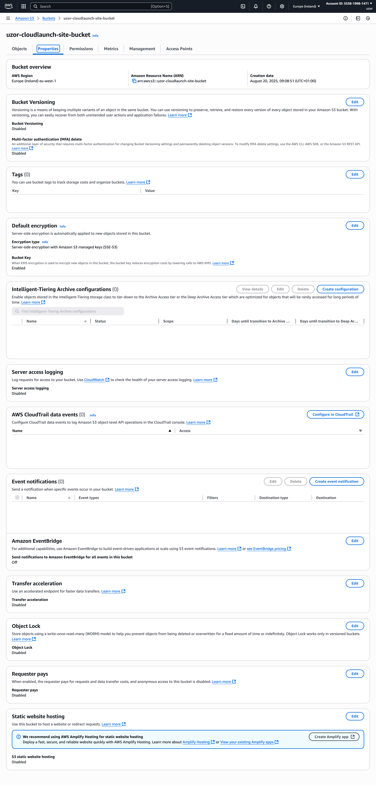
- In the static site setup form, enable static site hosting and provide the path to the index page in my case "cloud-watch-website/index.html" and then click on save changes
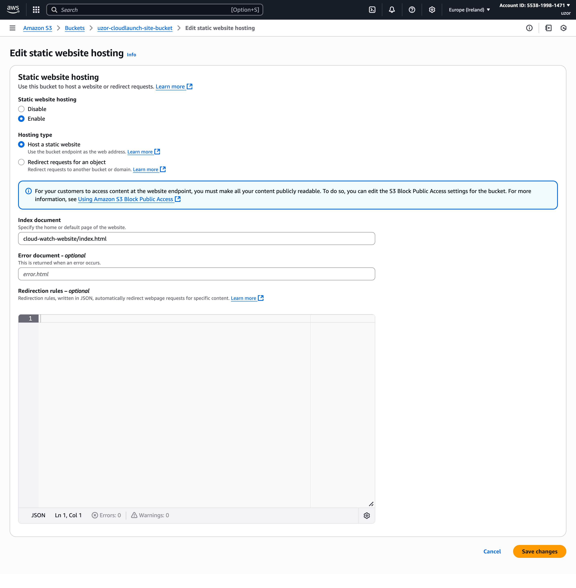
- Navigate to object ownership under the permissions tab and click on "edit"

- On the setup page click select ACLs enabled, check the acknowledgement box and click on "save changes"
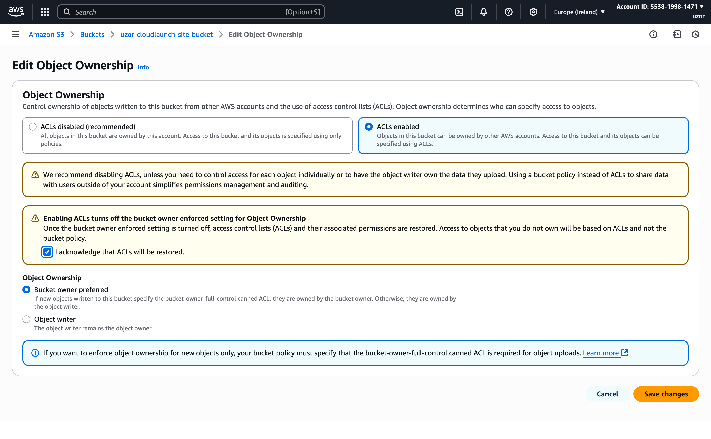
- Return to the objects tab and select all the objects in the bucket 

Click on the "Action" button at the top and in the dropdown that appears, click on "make public acls"

- In the bucket policy input field click on the "edit" button which opens the permission edit page, to only allow readonly permissions for anonymous users, add this permission block:
```
{
  "Version": "2012-10-17",
  "Statement": [
    {
      "Sid": "PublicReadGetObject",
      "Effect": "Allow",
      "Principal": "*",
      "Action": "s3:GetObject",
      "Resource": "arn:aws:s3:::uzor-cloudlaunch-site-bucket/*"
    }
  ]
}
```
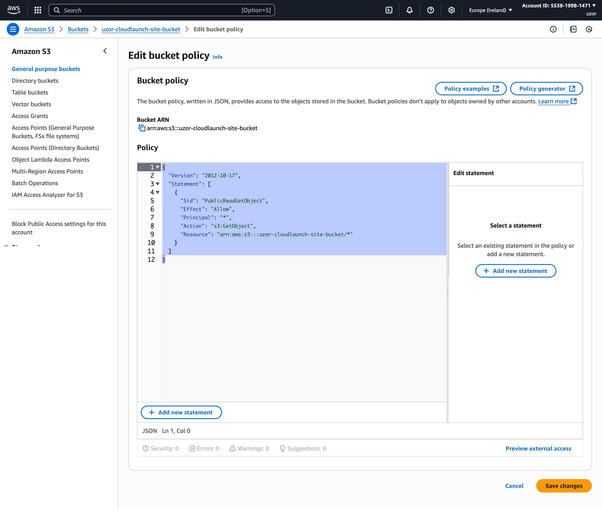
Click on save changes to complete
- Return to the bucket details page and select the properties tab, scroll down to the "Static website hosting" and click on the "Bucket website endpoint" link
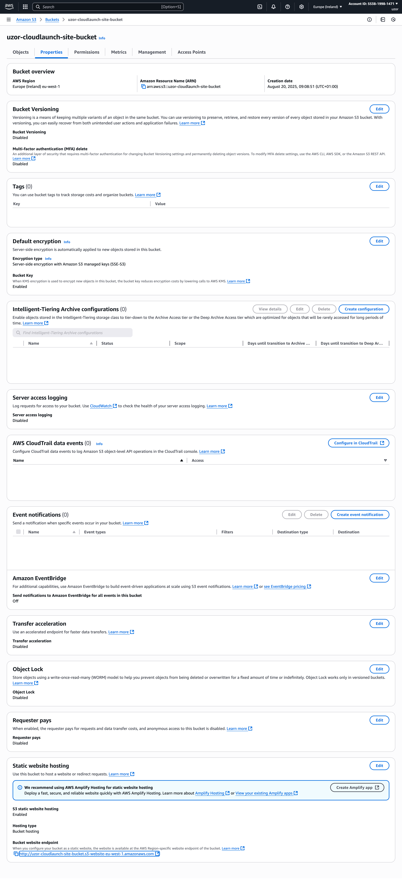

In my case the url is 
[http://uzor-cloudlaunch-site-bucket.s3-website-eu-west-1.amazonaws.com/](http://uzor-cloudlaunch-site-bucket.s3-website-eu-west-1.amazonaws.com/)

### 1b - CloudFront Setup
- Search for cloudfront on the search bar and select the result that appears 
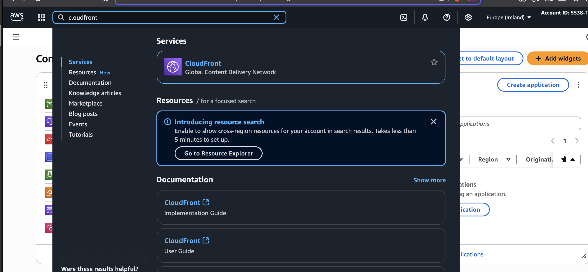
- On the cloudfront landing page select "create new cloudfront distribution"
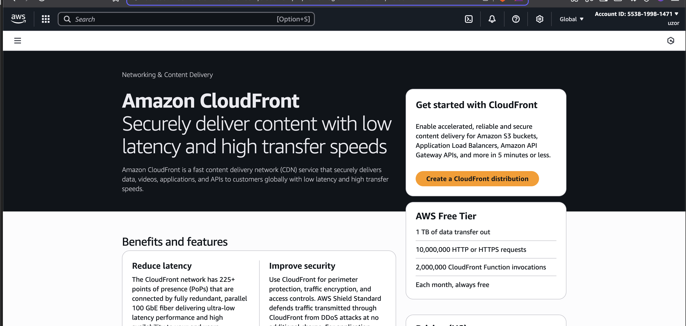
- A multi step form appears in the first step set the distribution name and description, ensure the distribution type is single website and app (which is the default) and click on next
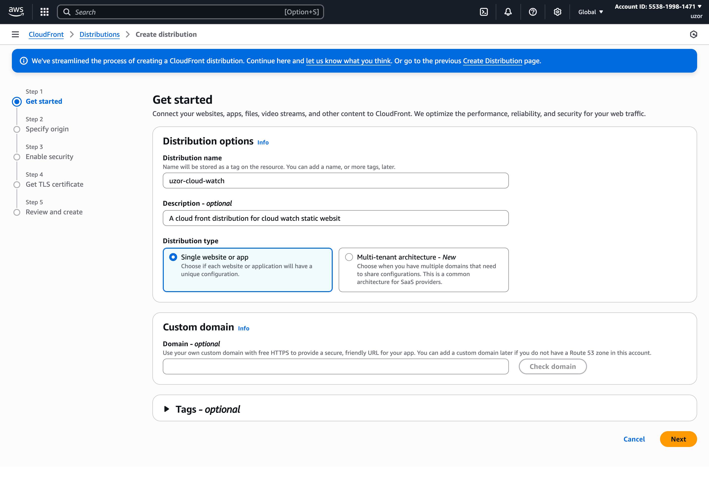
In the specify origin step, ensure the origin type is amazon s3 (the default). In the s3 origin input, click on browse s3 action button beside the input
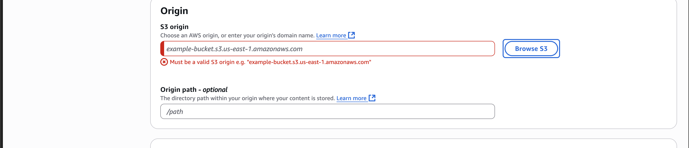
Select our cloud watch s3 url from the list and click on choose
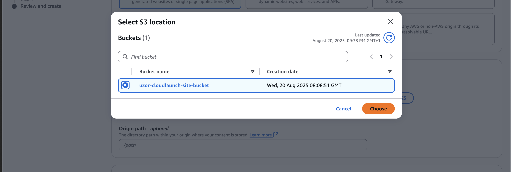
An action bucket to use s3 endpoint now appears, click it to proceed
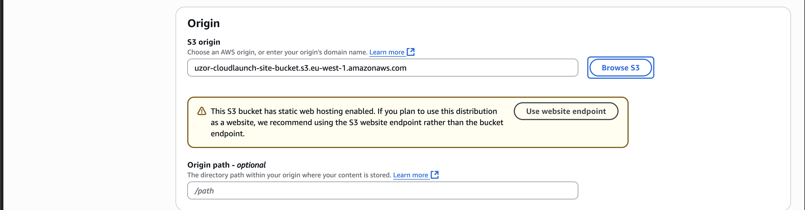
The completed section should look like this
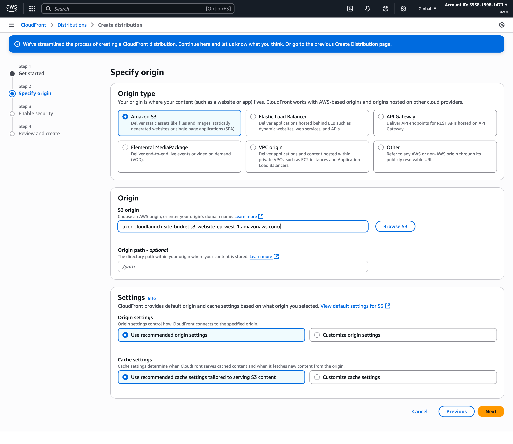
In the Enable Security section select "Do not enable security protection" as enabling security option may incure cost and click next
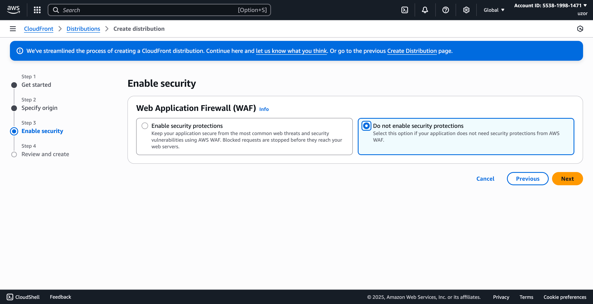
In the review and create section, click on create distribution
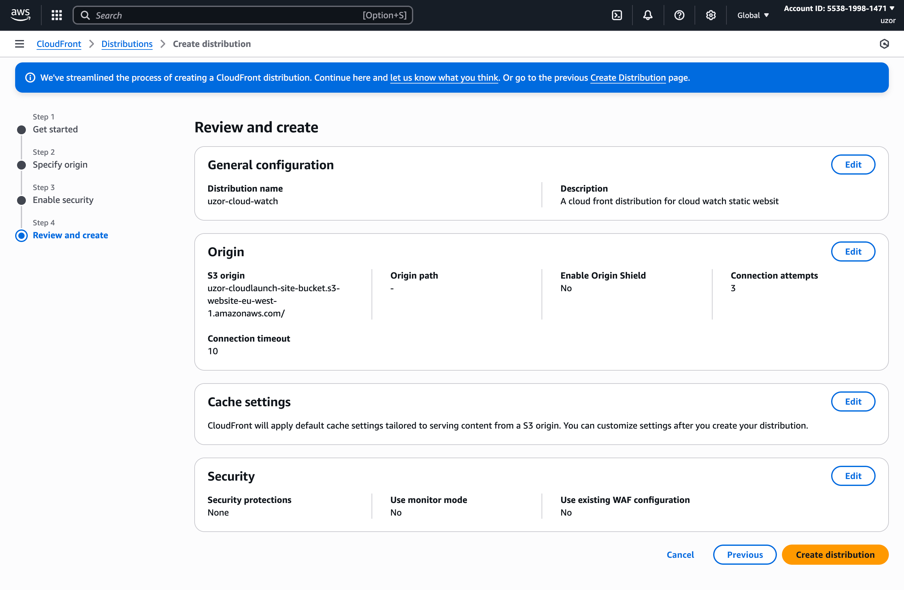
- Once this setup is complete you will be directed to a distribution details page for this distribution

Copy the distribution domain name and paste it into a browser, this become a link to your website hosted on the cdn in my case <br />
[https://d1eb34ny79m6vq.cloudfront.net/](https://d1eb34ny79m6vq.cloudfront.net/)


### 2. Cloudlaunch-private-bucket
- Click on S3 from the recently visited tab and select create S3 bucket
- In the bucket name add "uzor-cloudlaunch-private-bucket" and keep all the other settings as default
- Click on create bucket

### 3. Cloudlaunch-visible-only-bucket
- Repeat the steps for creating the private bucket but the name of this bucket should be "uzor-cloudlaunch-visible-only-bucket
"

### IAM User
- On the recently visited section on the console home page, select IAM
- On the users page, select "Users" from the sidebar and click on create user
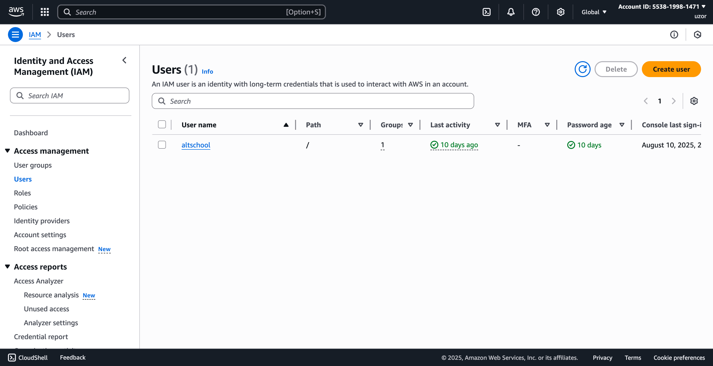
- In the multi-step create user form that appear, in step 1, set the user name to "cloudlaunch-user" and click on next
- Step 2 of the form "Set Permission", click on the "create group" action button to create a group for the user with the required permission

- To grant user **ListBucket** access on all three buckets: 
    - In the select a service dropdown, select S3
    - In the action allowed section, search for "ListBucket" and check the select input that appear
    - Under the resources section, ensure it is set to specific (which is the default)
    - Under the bucket subsection of the resources tab, click on "Add ARN" and a form pops up with two input fields, **Resource bucket name** and **Resource ARN**. Add the bucket name for the static site to the bucket name field in my case *uzor-cloudlaunch-site-bucket*, the resource arn field is automatically populated
    
    - Repeat the above step 2 more time but in each case add the private bucket url (*uzor-cloudlaunch-private-bucket* in my case) and the visible only bucket url (*uzor-cloudlaunch-visible-only-bucket* in my case) should be added
- To add **GetObject** to the *cloudlaunch-private-bucket only* and *cloudlaunch-site-bucket* buckets 
    - click **Add more permission** which opens up a new permission form 
    - select s3 as the service
    - click on the **add arn** button under the bucket subsection of the resources section and in the form that pops up add the bucket name of the private bucket (*uzor-cloudlaunch-private-bucket* in my case) and click on **add arn**
    - Repeat the previous step but this time use the static static site bucket url (*uzor-cloudlaunch-site-bucket* in my case)
- To add **PutObject** permission to the cloudlaunch-private-bucket
    - again search for s3 on the service section
    - In the action search for and select **PutObject**
    - click on the **add arn** button under the bucket subsection of the resources section and in the form that pops up add the bucket name of the private bucket (*uzor-cloudlaunch-private-bucket* in my case)
    - An extra field object applies, just select the all objects checkbox
    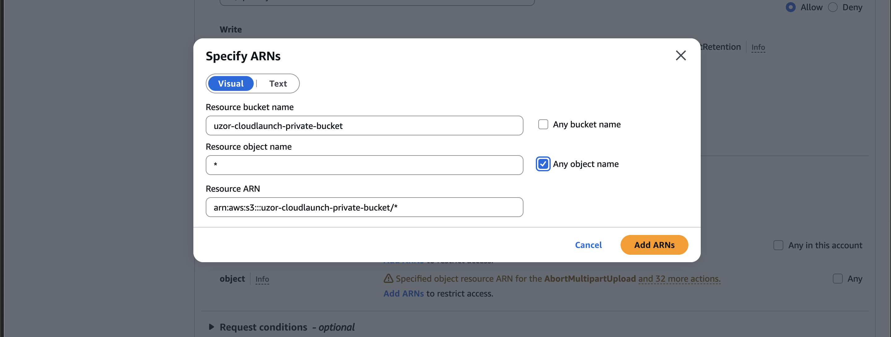
    - Click on **add arn** to save

- In order to be able to view the buckets, we need to add the **GetBucketLocation** permission for the 3 buckets. To do this
    - search for s3 on the services section
    - in the action search for and select **GetBucketLocation**
    - click on **add arn** and add the first bucket name (*uzor-cloudlaunch-private-bucket* in my case) and click on add arn
    - repeat this process for the other 2 bucket names

- I ran into an issue viewing the bucket so I had to give the policy the **ListAllBuckets** permission
    - search for s3 under the services section
    - in the 

The completed setup should look something like this
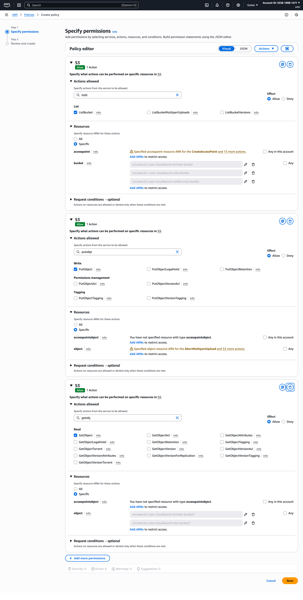
Click on next to continue
- The json policy file for this policy is 
```
{
    "Version": "2012-10-17",
    "Statement": [
        {
            "Sid": "VisualEditor0",
            "Effect": "Allow",
            "Action": "s3:ListAllMyBuckets",
            "Resource": "*"
        },
        {
            "Sid": "VisualEditor1",
            "Effect": "Allow",
            "Action": "s3:ListBucket",
            "Resource": [
                "arn:aws:s3:::uzor-cloudlaunch-private-bucket",
                "arn:aws:s3:::uzor-cloudlaunch-site-bucket",
                "arn:aws:s3:::uzor-cloudlaunch-visible-only-bucket"
            ]
        },
        {
            "Sid": "VisualEditor2",
            "Effect": "Allow",
            "Action": "s3:GetObject",
            "Resource": [
                "arn:aws:s3:::uzor-cloudlaunch-private-bucket/*",
                "arn:aws:s3:::uzor-cloudlaunch-site-bucket/*"
            ]
        },
        {
            "Sid": "VisualEditor3",
            "Effect": "Allow",
            "Action": "s3:PutObject",
            "Resource": "arn:aws:s3:::uzor-cloudlaunch-private-bucket/*"
        }
    ]
}
```
- There is no need to explicitly specify the other two policies
    - No DeleteObject permissions anywhere.
    - No access to cloudlaunch-visible-only-bucket content.
    as they are disabled by default
- In the review policy tab, add a policy name and description for the policy and click on **create policy**
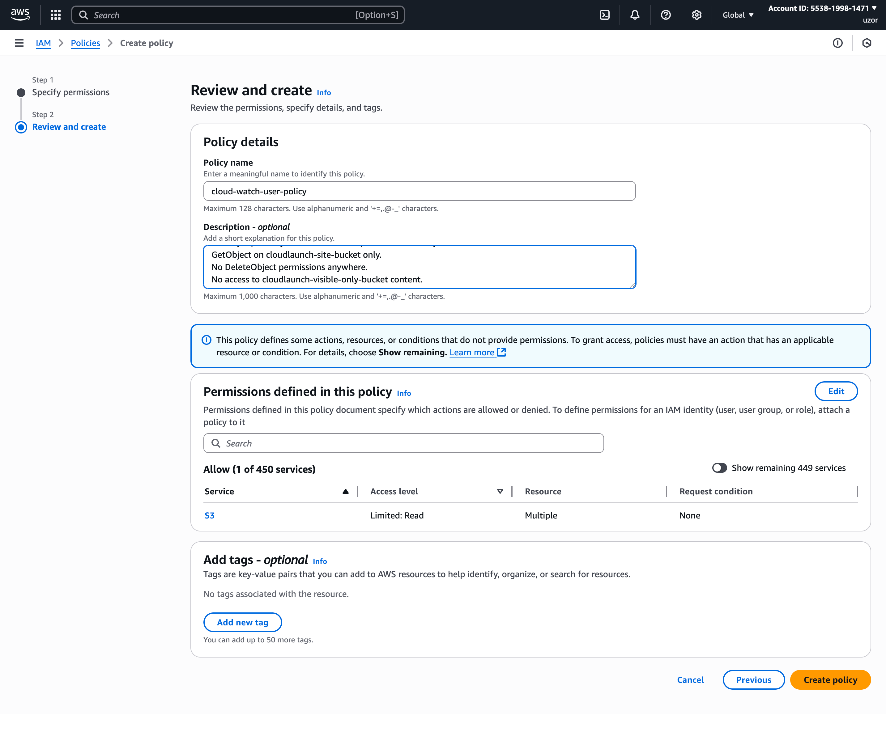

- Return to the **create user** page
    - set the username to **cloudlaunch-user**
    - check the **Provide user access to the AWS Management Console - optional** checkbox
    - In the **Are you providing console access to a person?** select the *I want to create an IAM user* option
    - Check **Users must create a new password at next sign-in - Recommended** checkbox
    - click on next
    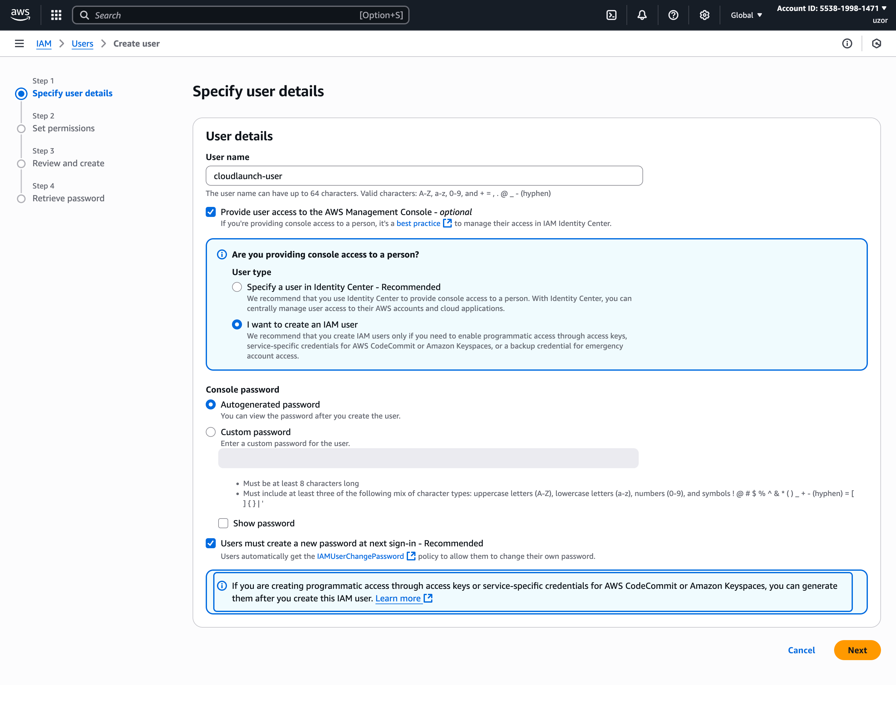
- In the **Set Permission** section, click on the **attach policy** option, in the list that appear select CloudLauchUserPolicy (the one we created) and click on next
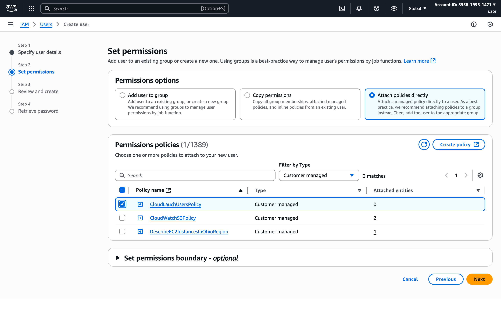
- In the review and create section, click on create user

The created user credentials are 
- username: cloudlaunch-user
- password: qY3%(I(5
- sign in url: [https://553819981471.signin.aws.amazon.com/console](https://553819981471.signin.aws.amazon.com/console)

## Task 2: VPC Design for CloudLaunch Environment
- In the recently visited section of the home screen select **vpc**
- Click on the **Create vpc** action button
- In the **create vpc** form that pops up , ensure the option **vpc and more** is select and set the name tag to **cloudlaunch-vpc**
- Set the **IPv4 CIDR block** to **10.0.0.0/16**
- In the number of availability zones, set it to 1 
- Set the number of public subnets to 1 and number of private subnets to 2
- Expand the customize subnet dropdown
    - Set the public subnet CIDR to **10.0.1.0/24** this is for load balancers or future public-facing services
    - Set the first private subnet CIDR to **10.0.2.0/24** this is for the app servers
    - Set the second private subnet CIDR to **** this is for RDS-like services
- Leave the rest of the settings as default and click on **create vpc** action button
- The complete form should look like this
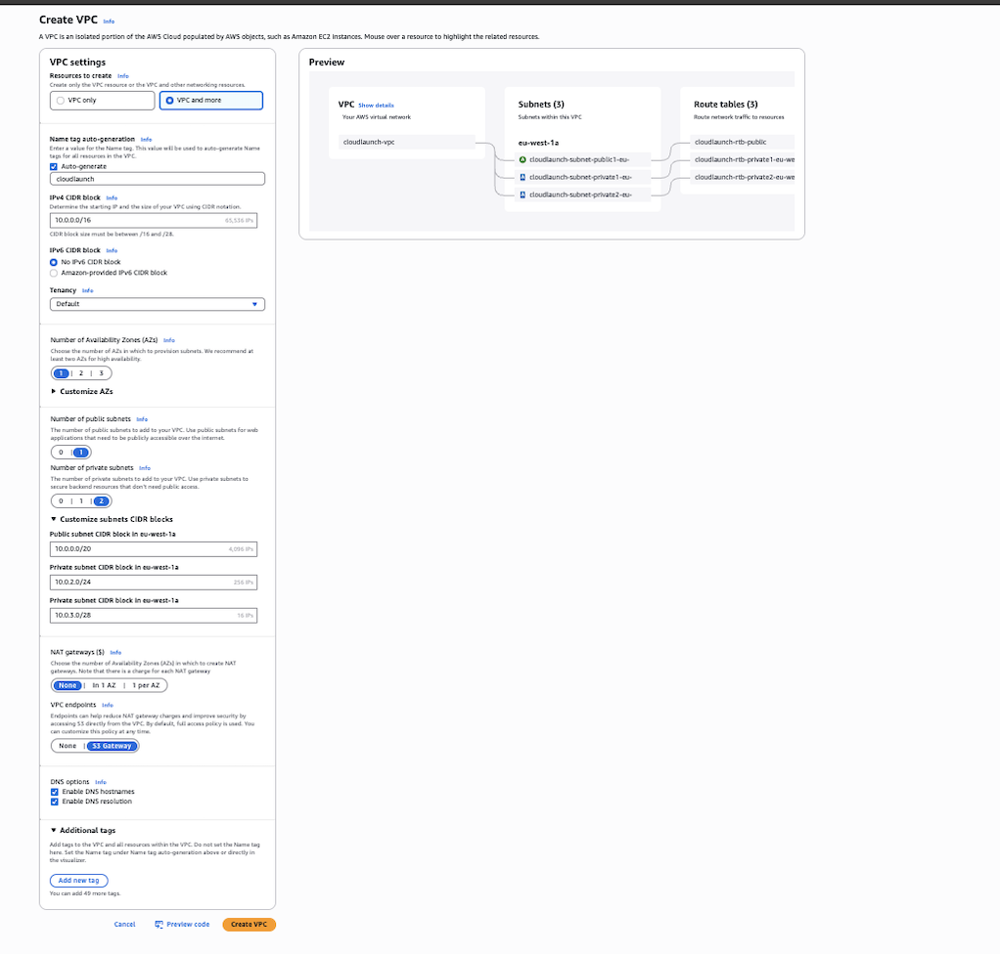
- My completed vpc map looks like this 
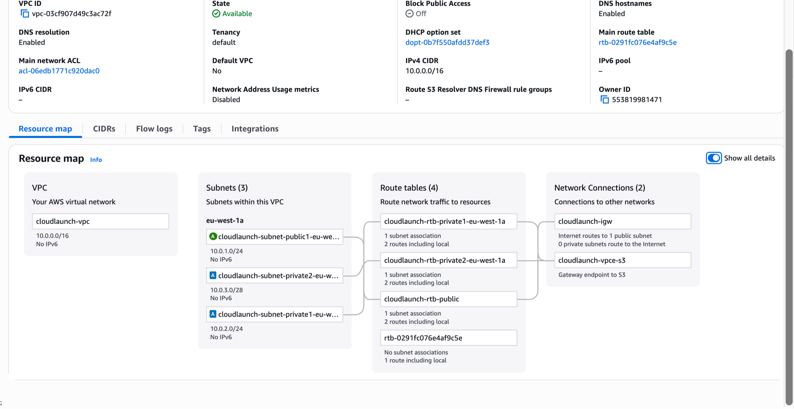

### Internet Gateway
- In the **vpc dashboard**, click on **internet gateway** from the sidebar
- Click on **create internet gateway** on the page that appear
- In the form that appears, set the **Name tag** to **cloudlaunch-igw** and click on **create internet gateway**

- On successful, it should redirect to the details page for the newly created gateway and an action button **attach to vpc**
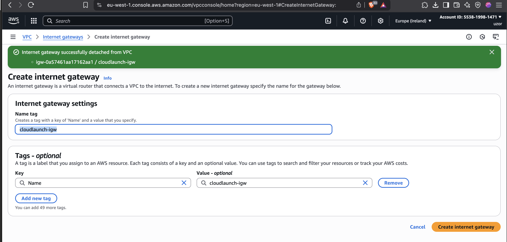
- In the attach to vpc page select the cloudlaunch vpc and click on **attach internet gateway**
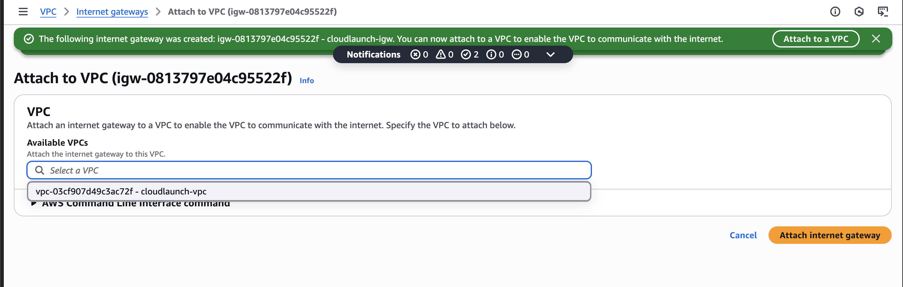

### Route Table
### 1. Route Table for Public Subnet
- In the vpc dashboard page, select **Route tables** from the sidebar
- Click on the **create route table** action button
- In the form that appear, set the route table name to **cloudlaunch-public-rt**
- In the vpc option, select cloudlaunch vpc and click on **create route table**
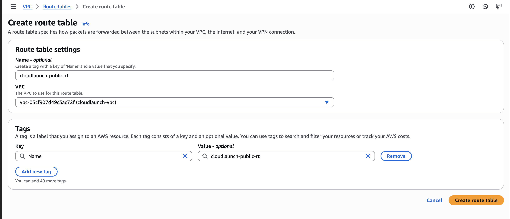
- On successful creation, you will get redirected to the details page for the route table
- In the route table details page, select the **subnet association** tab and click on **edit subnet association**
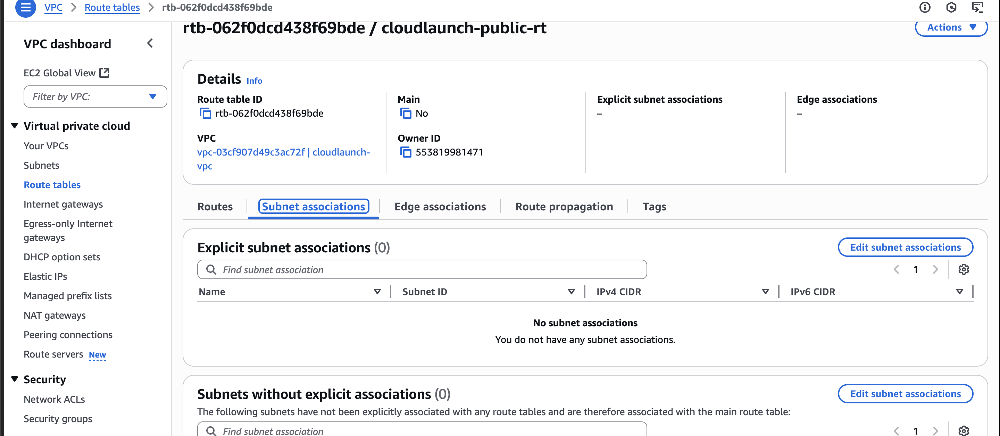
- In the list of subnets that appear, select the public subnet from the list and click on **save association**
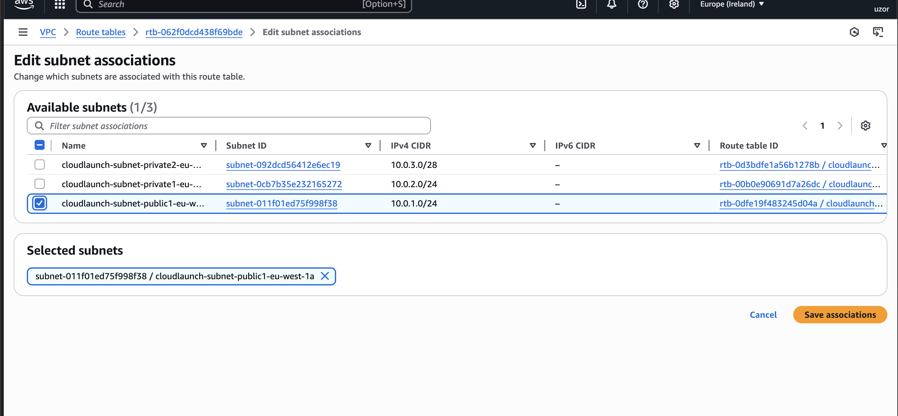
- Return to the **route** tab of the route table details and click on **edit route**
- In the edit route page, click on **add route**, in the destination add **0.0.0.0/0**, in the target select the internet gateway and select the **cloudlaunch-igw**. Click on **Save Changes**
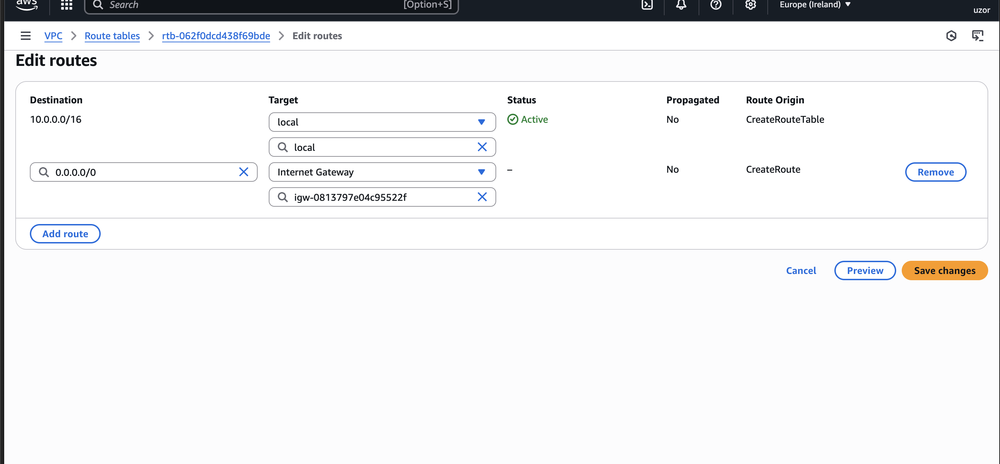

### 2. Private Subnet Route Tables
- Create two new route table **cloudlaunch-app-rt** and **cloudlaunch-db-rt**
- For the **cloudlaunch-app-rt** in the **subnet association** select the Application Subnet (10.0.2.0/24)
- For the **cloudlaunch-db-rt** in the **subnet association** select the Database Subnet (10.0.3.0/28)
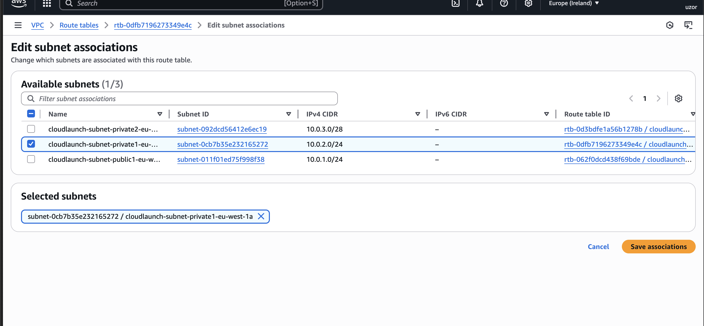
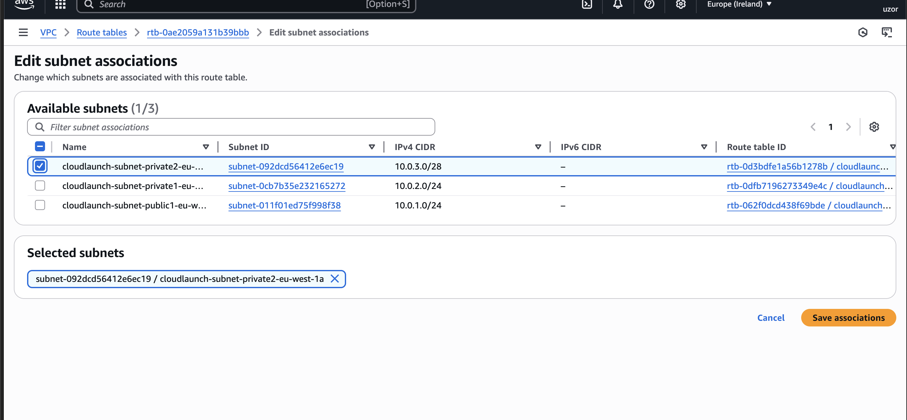

### Security Groups
### 1. cloudlaunch-app-sg
- In the vpc dashboard sidebar, select **security groups**
- Click on **create security group**
- In the form that appear set the name of the security group to **cloudlaunch-app-sg** and set the vpc to the cloudlaunch vpc
- In the **Inbound Rules** section, select type **HTTP**, in the source select **custom** and set the ip address to **10.0.0.0/16** (the vpc ip address)
- In the **Outbound Rules** section, clear any default selection to ensure nothing is selected
- Click on **create security group**
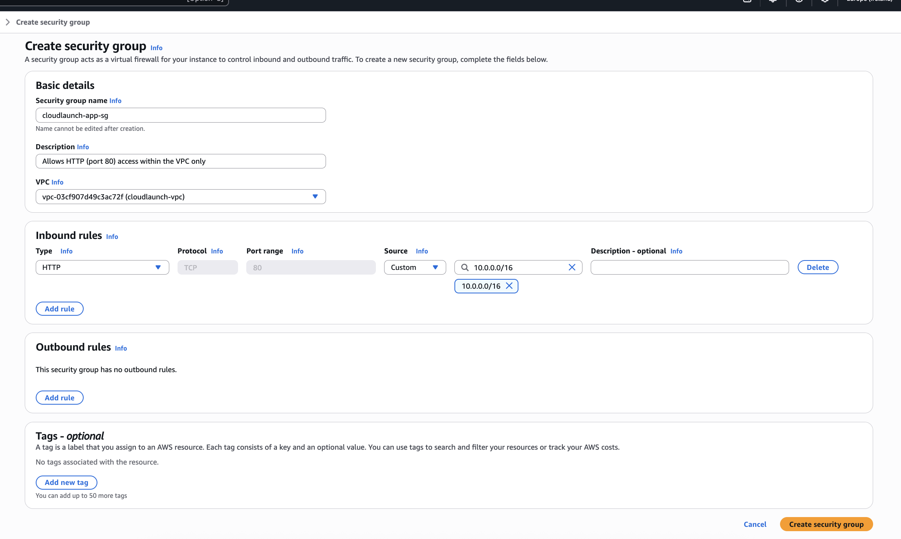
### 2. cloudlaunch-db-sg
- Click on **security groups** from the sidebar
- Set the name of the security group to **cloudlaunch-db-sg** and select the cloudlauch vpc
- In the **Inbound Rules** section, select type **MYSQL/Aurora**, in the source select **custom** and set the ip address to **10.0.2.0/24** (the application subnet)
- In the **Outbound Rules** section, clear any default selection to ensure nothing is selected
- Click on **create security group**
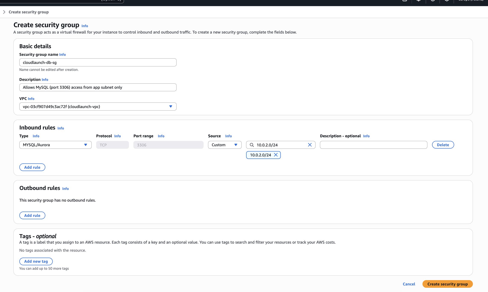

###  IAM Permissions
- Return to the console home page and select **IAM** from the recently visited section
- Click on **policies** and click on **create policy**
- In the services section selected **EC2** as vpcs are under EC2
- In the action section
    - Search for an check **DescribeVpcs**
    - Search for and check **DescribeSubnets**
    - Search for and check **DescribeRouteTables**
    - Search for and check **DescribeInternetGateways**
    - Search for and check **DescribeNatGateways**
    - Search for and check **DescribeSecurityGroups**
    - Search for and check **DescribeNetworkAcls**
    - Search for and check **DescribeVpcPeeringConnections**
    - Search for and check **DescribeVpnGateways**
    - Search for and check **DescribeCustomerGateways**
    - Search for and check **DescribeTransitGateways**
    - Search for and check **DescribeVpcEndpoints**
    - Search for and check **DescribeTags**
- Click on next and click **create policy**

The json policy can be found below:
```
{
    "Version": "2012-10-17",
    "Statement": [
        {
            "Sid": "VisualEditor0",
            "Effect": "Allow",
            "Action": [
                "ec2:DescribeTags",
                "ec2:DescribeVpcPeeringConnections",
                "ec2:DescribeTransitGateways",
                "ec2:DescribeNatGateways",
                "ec2:DescribeCustomerGateways",
                "ec2:DescribeSecurityGroups",
                "ec2:DescribeInternetGateways",
                "ec2:DescribeVpcs",
                "ec2:DescribeVpcEndpoints",
                "ec2:DescribeSubnets",
                "ec2:DescribeNetworkAcls",
                "ec2:DescribeRouteTables",
                "ec2:DescribeVpnGateways"
            ],
            "Resource": "*"
        }
    ]
}
```

### CloudLauch Group
To make it easier to share the same set of permissions and policies, create a cloudlauch-group, to do this
- Click on **user groups** from the IAM sidebar
- Click on **create group**
- Set the group name to **cloudlaunch-users-group**
- In the users, select the **cloudlaunch-user** and in the **Attach permissions policies** select the **CloudLaunchUserPolicy** and **CloudLaunchVPCReadOnly**
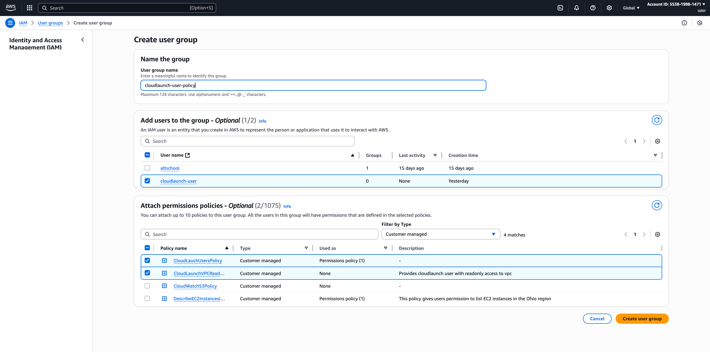
- Click **create user group**

## Summary
1. S3 Site Link
[http://uzor-cloudlaunch-site-bucket.s3-website-eu-west-1.amazonaws.com/](http://uzor-cloudlaunch-site-bucket.s3-website-eu-west-1.amazonaws.com/)
2. CloudFront site url
[https://d1eb34ny79m6vq.cloudfront.net/](https://d1eb34ny79m6vq.cloudfront.net/)
3. IAM user policy
- CloudLaunchUserPolicy
    ```
    {
    "Version": "2012-10-17",
    "Statement": [
        {
            "Sid": "VisualEditor0",
            "Effect": "Allow",
            "Action": "s3:ListAllMyBuckets",
            "Resource": "*"
        },
        {
            "Sid": "VisualEditor1",
            "Effect": "Allow",
            "Action": "s3:ListBucket",
            "Resource": [
                "arn:aws:s3:::uzor-cloudlaunch-private-bucket",
                "arn:aws:s3:::uzor-cloudlaunch-site-bucket",
                "arn:aws:s3:::uzor-cloudlaunch-visible-only-bucket"
            ]
        },
        {
            "Sid": "VisualEditor2",
            "Effect": "Allow",
            "Action": "s3:GetObject",
            "Resource": [
                "arn:aws:s3:::uzor-cloudlaunch-private-bucket/*",
                "arn:aws:s3:::uzor-cloudlaunch-site-bucket/*"
            ]
        },
        {
            "Sid": "VisualEditor3",
            "Effect": "Allow",
            "Action": "s3:PutObject",
            "Resource": "arn:aws:s3:::uzor-cloudlaunch-private-bucket/*"
        }
    ]
    }
    ```
- CloudLaunchVPCReadOnly
```
{
    "Version": "2012-10-17",
    "Statement": [
        {
            "Sid": "VisualEditor0",
            "Effect": "Allow",
            "Action": [
                "ec2:DescribeTags",
                "ec2:DescribeVpcPeeringConnections",
                "ec2:DescribeTransitGateways",
                "ec2:DescribeNatGateways",
                "ec2:DescribeCustomerGateways",
                "ec2:DescribeSecurityGroups",
                "ec2:DescribeInternetGateways",
                "ec2:DescribeVpcs",
                "ec2:DescribeVpcEndpoints",
                "ec2:DescribeSubnets",
                "ec2:DescribeNetworkAcls",
                "ec2:DescribeRouteTables",
                "ec2:DescribeVpnGateways"
            ],
            "Resource": "*"
        }
    ]
}
```
